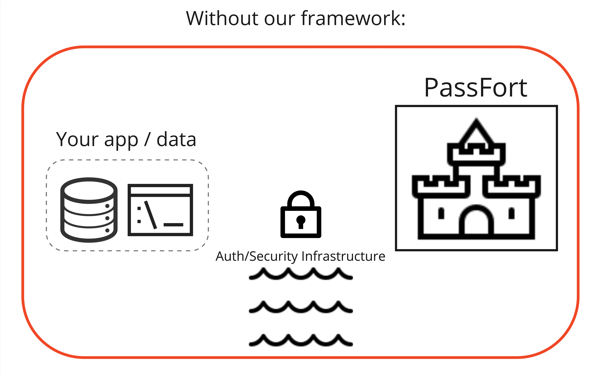
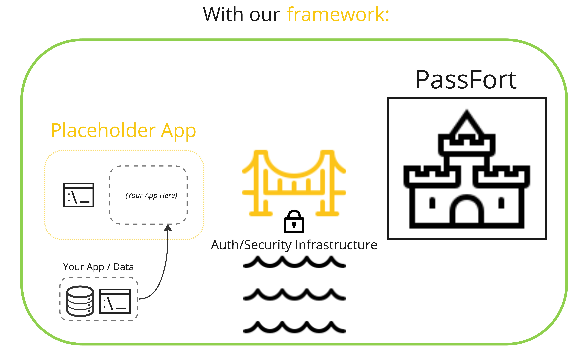

## Introduction

This repository provides a code skeleton, and step-by-step setup instructions, intended to simplify the process of integrating external data sources and applications into PassFort. PassFort created the "Custom Check" (details below) as a means for external communication with their API- this repository has modularized the basic requirements for a valid Custom Check in PassFort.

Here is a basic visualization of what this repository accomplishes:

It is possible to integrate your application or data source as a Custom Check without using our framework. However, this would require a potentially tedious process as you navigate through security measures represented here by the water or moat.

This code framework takes care of the steps required to securely communicate with PassFort, represented here by a bridge. This allows you to begin your implementation process with auth already in place.

Follow the steps outlined below to build our placeholder app in your own hosting environment and make that app available as a Custom Check within your PassFort instance. Once you can see our mock UI, you are ready to integrate your own front and backend atop the existing skeleton!

For deeper understanding and development beyond a basic check, please refer to our interactive check building tool - PartnerFort.
The core documentation is avaliable here: [PassFort API Reference](https://passfort.github.io/integration-docs/?javascript#introduction).

## Prerequisites

In order to use a custom check you must satisfy the following conditions:

- You must have access to Orbis, the entity metatdata database used by PassFort.
- You must generate a 32 byte key secret key ([more info here](https://passfort.github.io/integration-docs/?javascript#authentication)).
  - You can use the following formula in a linux/mac terminal:
    - `§ dd if=/dev/urandom bs=32 count=1 2>/dev/null | base64`
- Your integration must be served over HTTPS.
- You must have the "Institutional Admin" role within your PassFort Institution.

## Custom Checks - what and why?

PassFort takes precautions to ensure the security of it's environment, and extends these precautions to users of the Custom Check paradigm through authentication and signature validation. Here we will outline the flow of information in an existing Custom Check to contextualize what's been modularized for you in this repository (See 'Getting Started' for details on how to setup your Custom Check).

When a Custom Check is initiated by a PassFort user, PassFort makes a request to the url provided for that Custom Check during setup. This request contains basic metadata for the company being checked, any user-defined criteria (perhaps some threshold that determines a passing or failing check), and your integration key included via http signature.

This request is validated by your API through our VerifySignatureGuard before being further processed. This processing is where you may add complexity for your own Custom Check. In our basic example check, to demonstrate the flow of data, we simply return a boolean based on whether or not the country of incorporation is USA or GBR.

PassFort expects a specific format for any check response, which is defined in [the documentation](https://passfort.github.io/integration-docs/?javascript#demo-checks). We've included a function createResponseObject in the api/src/utils/pf-integration.helpers.ts file which builds this formatted response. This response includes a 'result' property which let's PassFort know to display Pass/Fail/Partial, and an 'external_resources' property where you can pass on a link to your applications frontend which can then be embedded within PassFort.

PassFort digests your API's response, displays the check results to the user, and calls your provided embed link to display your UI as an iFrame within PassFort. For security, we use a two step process here involving an HTML intermediary and the tokenization of your encoded endpoint/auth information. This lilypad gives us a safe way to finally display your UI within our PassFort environment. It's common to include an identifier of some kind in your embed url as a query parameter- this index allows your API to access any data that was captured for that given entity or check.

## Getting Started

LOCALLY - verify that this check is working on your local machine

1. Clone this repository to your local machine.
2. Install dependencies in both the frontend/ and api/ folders using npm. (npm install)
3. Create a backend .env file based on our api/.env.example file, replacing anonymized placeholders with values that pertain to your instance.
   - DEBUG should be set to "true" for this LOCAL setup. This allows us to skip authorization that we'll need when we actually communicate with PassFort.
   - EXTERNAL_URL is the url that reaches your UI, we do not require this variable for local setup.
4. Create an frontend .env file based on our frontend/.env.example file
   - REACT_APP_BASE_URL should be set equal to the url that your backend is running on (for local development, this should be the PORT in your backend .env appended to your localhost i.e. `http://localhost:3000`)
   - This variable is plugged into the file at frontend/src/setupProxy.js , which allows us to access our application through a single endpoint by forwarding /api requests to our backend.
   - This variable is also used in frontend/src/DataLoader.ts to get check-specific data from your backend to hydrate your UI upon render. This is where the index or identifier you appended to the url in your CheckResponse can be leveraged to access data that is specific to this entity or check.
5. Run your server by navigating to the api/ folder and running the npm run start:dev command.
6. In another terminal session, navigate to your frontend/ folder and start your react server using npm run start.Insert the react server's address (likely `http://localhost:8000`) into the url, including an ID (`http://localhost:8000/1`).
   - This ID would later be grabbed from the url you send through PassFort in the embedded_resources property of your check response. This would identify the specific check your UI should display.
7. Run this frontend server address via browser of choice to display the check! Next we will follow steps to get this app accessible within PassFort.

IN PASSFORT - get this basic check passing all validation and visible in PassFort

1. Deploy this application, or expose the front and backend ports - PassFort requires publicly available endpoints to communicate with in the operation of your custom check.
   - If deploying, replicate steps from LOCAL with the appropriate URL changes.
2. Update your api/.env
   - Set DEBUG to 'false', now that will be communicate with PassFort we will be required to validate our incoming requests.
   - Set INTEGRATION_SECRET_KEY to your 32-byte secret key (see prerequisites)
   - Set EXTERNAL_URL to your deployed frontend's endpoint
3. Start your api/ server
4. Start your frontend/ server
5. Create your data provider in PassFort
   - In your PassFort portal, navigate to 'Policy builder'
     - You must have "Institutional Admin" priveledges to see this tab, see Prerequisites.
   - Click 'add New data provider' in the top right, select 'company data provider'
   - Select 'Custom Company Custom Check - Company custom check' from the dropdown.
   - Input a name for this check in the 'Variant name' text field.
   - Click 'Create'
   - On the right hand side of the screen you will find two form fill opportunities for 'Integration URL' and 'Secret Key'
     - Your 'Integration URL' is your frontend hosted url, with your /api/.env URL_PREFIX and a trailing slash appended to the end of the string (this will be '/api/' unless you have edited that variable).
       - https://[your frontend url here]/api/
     - 'Secret Key' is your 32-byte key, exactly as it appears in your /api/.env
   - Click 'Run Validation'
   - With 30/30 tests passing, select 'Save'
     - Common errors:
       - leaving off the trailing forward slash on your Integration URL
       - not having updated your /api/.env to set `DEBUG="false"`
6. Configure a Custom Check in PassFort including your new data provider
   - Select 'Check configuration' from the menu on the left hand side within Policy Builder
   - Select 'Add New check configuration' from the top right of the page, select 'Company check'
   - Select 'Company custom check' from the Check type dropdown.
   - Enter a name for your Custom Check.
   - Select 'Create'
   - Optionally add an Alias for your check.
   - Select the data provider you just created form the list of check providers.
   - Select 'Save'
7. Configure a Task for your Custom Check
   - Select 'Tasks' from the menu on the left hand side within Policy Builder
   - Select 'new compliance task' from the top right of the page, choose 'Company task'
   - Under 'Automatic Checks', select 'Add Check' and pick your newly created check from the list.
   - Select 'Save'
8. Configure a 'Smart Policy' to include your Task
   - Select 'Smart policies' from the menu on the left hand side within Policy Builder
   - Select 'add New smart policy'
   - Rename the smart policy to your liking.
   - Within the graph area, hover your mouse away from the green dot until you see a light blue square area appear with a darker blue '+' icon at the center appear. Click at this location.
   - Select 'Tasks element' from the 'Add a new element' modal that should appear on your screen, and select 'Add tasks element' in the bottom left.
   - 'Edit' your newly created Task element, and 'Add a new task', selecting your newly created task from the search dropdown. Select 'Add task'.
   - Follow the process for adding a Task element, this time adding an Outcome element to conclude this Smart Policy.
     - Navigate to the blue '+' icon in the graph, click, select 'Outcome element', select 'Manual review', select 'Add outcome element'.
   - Create connection points in the graph between Start -> your Task element-> the Outcome element.
   - 'Save' Smart Policy
9. Create a 'Product', and add your 'Smart Policy' to it
   - Select 'Your products' from the menu on the left hand side within Policy Builder
   - Select 'New product', filling in a Name and optionally an Alias.
   - Check the box labeled 'Profiles will use the flow chart smart policy for this product'.
   - Select your newly created smart policy from the dropdown under 'Company Policy'
   - 'Save product'
10. Add a Profile to your Profiles page to test check
    - Navigate to the 'Profiles' tab in your PassFort portal
    - Select 'add New profile'
    - Navigate to 'Company' within the pop-up, and enter information for a reputable business in the United States to demonstrate the check (i.e. Moody's Analytics)
    - Select your newly created Product from the required 'Products' dropdown.
    - Create profile.
11. View Profile
    - Navigate to your newly created profile
    - Under 'Due Diligence Tasks' in the left hand panel, you should see your Custom Check.
    - Select it, and view the check results and UI being rendered from your deployed application!

## Next Steps

Now that you are able to communicate with PassFort, you can begin to transpose your app or data source into this framework. We've included a walk through in this repository under the `/next_steps` directory. To view this slideshow, navigate to the `/next_steps`, and run both `npi install` and `npm run start`. A window will open in your browser displaying a slide show to guide you through the lifecycle of a check and where to begin adding your own logic to this repository.

## Docs and Resources

[PassFort Integration Docs](https://passfort.github.io/integration-docs/?javascript#introduction) - Go in depth with the full scope of what's possible for your custom check.

[Partnerfort](https://github.com/matthewowen-ma/partnerfort) - An interactive tool you host locally to experiment with configurations for your custom check.

[CastleUI](https://castle.ux.passfort.com/docs/core/getting-started#1-install) - The design language used for PassFort products. Follow this guide for styling your custom check. This is built on top of

[NestJS](https://nestjs.com/) - The backend framework we have employed in modularizing this custom check code.

[React](https://react.dev/) - Frontend framework used for web development.

[React Router](https://reactrouter.com/en/main) - Routing library for a React frontend.

[Typescript](https://www.typescriptlang.org/) - Type-safe language used for the development of this custom check.

## FAQs

**Q:** What is a Bvdid?  
**A:** BvD ID is a unique identifier for an entity in the Orbis database. It is a 9 digit number that is used to identify an entity in the Orbis database.

**Q:** What is an Entity?  
**A:** An entity is the term PassFort uses to define the company, person, or other organization that is being checked.

**Q:** Can you explain the differences between a Check, Task, Product, and Smart Policy?  
**A:** A Check is a single request to run a check on an entity. A Task is a collection of checks that are run on an entity. A Product is a collection of tasks that are run on an entity. A Smart Policy is a collection of products that are run on an entity.

**Q:** Why can't I pass my check data directly back through PassFort?  
**A:** PassFort has strict requirements for what may be passed to it as a 'Check Result'. This helps ensure the security of the environment. Our workaround allows you to include an identifier as a query parameter, and make an API call to grab the necessary data on iFrame render.

**Q:** How do I add my application's UI to this check?  
**A:** We've included a step-by-step guide for where to go from here, available to you under 'Next Steps' in the README.md

**Q:** How will the UI know what entity to display data for?  
**A:** After saving your check data, you may pass the database identifier of that check's data back through PassFort as a query parameter. In our example code, we simply use the Bvdid of the organization to demonstrate this process, as we did not include a database in our example.
